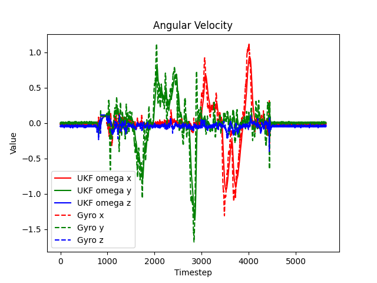
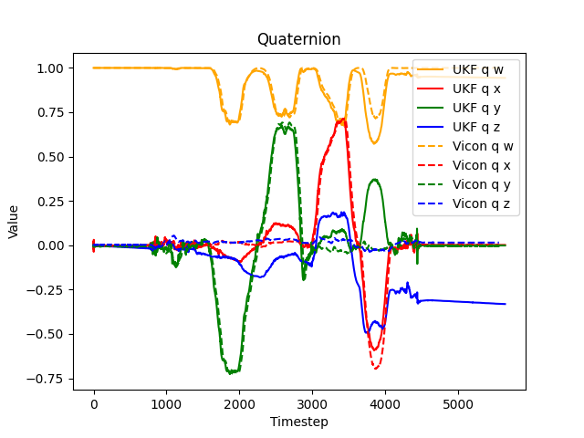

# UKF

Unscented Kalman Filter for 6DoF IMU

## How

1. Calibrate IMU using ground truth Vicon data. Use nonlinear least-squares to fit the bias and scale factor of the accelerometer and gyroscope.
2. Apply UKF on calibrated IMU acclerometer & gyro data to estimate the orientation of the IMU.

## Results

